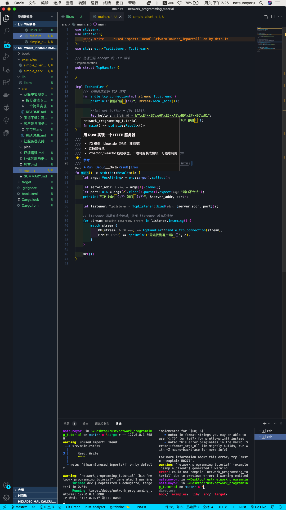

# 环境搭建

这是我用的Rust开发环境，大家可以参考：

- 编辑器 - VS Code
- 插件：
  - Rust服务器 - [Rust Analyzer](https://rust-analyzer.github.io/)

#### 推荐的VS Code插件

- Error lens（错误显示在发生错误的行）
- Bracket Colorizer（匹配不同作用域的花括号）
- Indent Rainbow（多彩显示缩进）
- Tabnine（代码智能补全）

